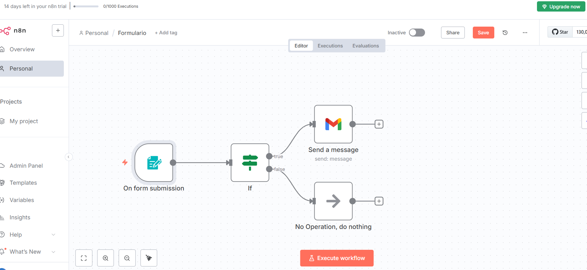
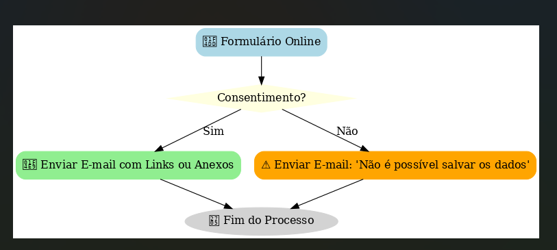
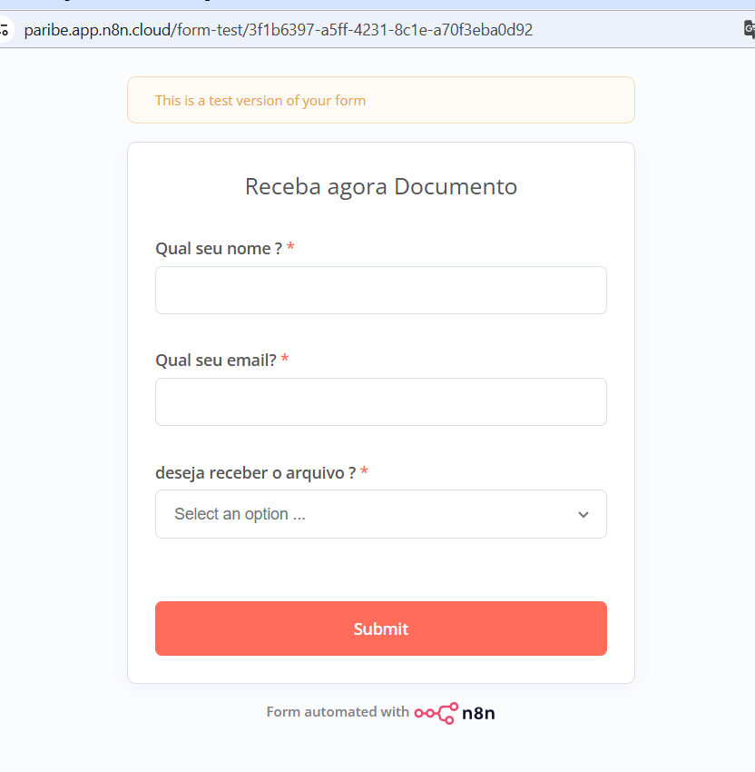
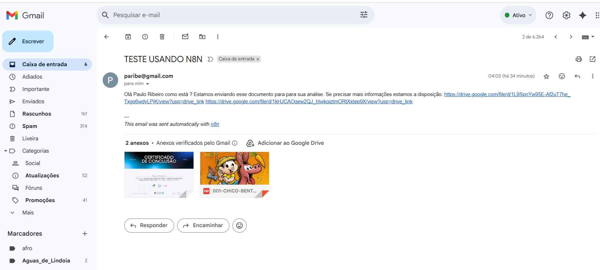

# 📌 Integração de Formulário com n8n e Envio de E-mails

Este projeto descreve como criar um **formulário online** integrado ao **n8n**, validando consentimento **(Sim/Não)** e enviando respostas por e-mail, tanto com **links** quanto com **arquivos anexos**.

---

## 🚀 Passo a Passo

### 1. Criar o Formulário

* Utilize **Google Forms** ou outro construtor de formulários.
* Campos recomendados:
  * Nome completo
  * E-mail
  * Pergunta de consentimento **“Aceita compartilhar seus dados para contato?”** (Sim/Não)
  * Perguntas adicionais (ex: área de interesse, empresa, cargo, etc.)

---

### 2. Configurar o n8n

* Adicione um nó **Webhook** → para receber os dados do formulário.
* Configure os campos para receber exatamente os mesmos nomes do formulário.

---

### 3. Validar Consentimento

No n8n:

* Adicione um nó **IF** para verificar se o campo `consentimento` == **Sim**.
* Se **Sim** → continua o fluxo.
* Se **Não** → envia e-mail informando que não é possível salvar os dados.

---

### 4. Enviar E-mail (Duas Formas)

#### ✅ Opção 1 – Envio com Links

* No nó **E-mail (SMTP)** configure:
  * Destinatário: e-mail do participante.
  * Corpo da mensagem: incluir os links para download ou para visualização (Google Drive, Dropbox, OneDrive etc.).

#### 📎 Opção 2 – Envio com Anexo

* Configure o mesmo nó **E-mail (SMTP)**.
* Adicione os arquivos desejados como anexos (PDFs, imagens, planilhas etc.).

---

### 5. Consentimento (LGPD)

Inclua no formulário a seguinte mensagem:

> “Autorizo o uso dos meus dados pessoais para fins de contato e comunicações da Jornada de Dados, conforme a LGPD.”

Somente prossiga no fluxo se o participante selecionar **Sim**.

---

## 📊 Mapeamento de Campos

| Campo Formulário        | Variável no n8n              |
| ----------------------- | ---------------------------- |
| Nome Completo           | `nome`                       |
| E-mail                  | `email`                      |
| Consentimento (Sim/Não) | `consentimento`              |
| Perguntas Extras        | `pergunta1`, `pergunta2` ... |

---

## 🔎 Troubleshooting

* **E-mail não chega** → Verifique se as credenciais SMTP estão corretas.
* **Anexo muito grande** → Use links em vez de anexos.
* **Consentimento não funciona** → Cheque se o campo “consentimento” está escrito exatamente igual no formulário e no n8n.

---

✅ Agora você tem um fluxo automatizado no **n8n** para receber respostas, validar consentimento e enviar materiais via e-mail.

---

---

## 🔄 Fluxograma do Processo

Evidências :

